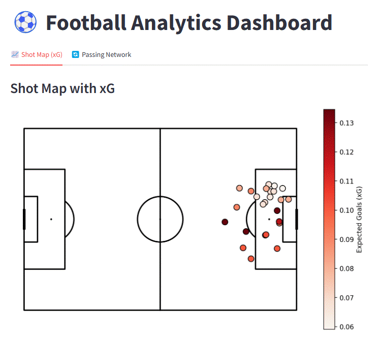

# Football Analytics Dashboard

[](https://football-analytics-portfolio.streamlit.app/)

## Features

- Expected goals (xG) model training and evaluation  
- Interactive Streamlit dashboard for match-day analytics  
- Data fetching & preprocessing pipeline  

## Demo



---

## Project Structure

```plaintext
football-analytics-dashboard/
│── data/                 # Raw & processed datasets
│   │── 15946.json        # Raw match event data
│   │── shots_data.csv    # Extracted shot data
│   │── processed_shots.csv # Cleaned data for xG model
│
│── models/               # Trained ML models
│   │── xgboost_xg_model.pkl  # Trained xG model
│
│── src/                  # Source code for the project
│   │── fetch_statsbomb.py   # Fetch match data from StatsBomb
│   │── fetch_shots_data.py  # Extract shot data from raw JSON
│   │── preprocess_xG.py     # Clean and process shot data
│   │── train_xG_model.py    # Train xG model using XGBoost
│   │── passing_network.py   # Analyze passing networks
│   │── dashboard.py         # Streamlit dashboard
│   │── ui.py                # UI Optimization
│
│── README.md             # Project documentation (this file)
│── .gitignore            # Ignore unnecessary files (e.g., .csv, .pkl)
│── requirements.txt     # Python dependencies
│── dashboard.gif         # Dashboard Preview
```

---

## 🚀 Installation Guide

### 1️⃣ Clone the Repository

```bash
git clone https://github.com/YOUR_GITHUB_USERNAME/football-analytics-dashboard.git
cd football-analytics-dashboard
```

### 2️⃣ Create a Virtual Environment

```bash
python -m venv venv
source venv/bin/activate  # On Windows use: venv\Scripts\activate
```

### 3️⃣ Install Dependencies

```bash
pip install -r requirements.txt
```

---

## 🏆 Running the Project

### 1️⃣ Fetch Football Data

```bash
python src/fetch_statsbomb.py
```

### 2️⃣ Extract & Preprocess Shot Data

```bash
python src/fetch_shots_data.py
python src/preprocess_xG.py
```

### 3️⃣ Train xG Model

```bash
python src/train_xG_model.py
```

### 4️⃣ Run Interactive Dashboard

```bash
streamlit run streamlit_app.py
```

---

## 📊 Example Visualizations

### Expected Goals (xG) Shot Map

- Displays **shot locations** & predicted xG on a football pitch.
- Uses **mplsoccer** & **Plotly** for visualization.

### Passing Network Analysis

- Shows **team passing structures** using **NetworkX**.
- Identifies **key playmakers & team dynamics**.

---

## 🔥 Future Improvements

- ✅ Deploy xG model API for real-time predictions.
- ✅ Enhance passing network analysis with tactical insights.
- ✅ Improve UI with team colors & player details.

---

## 🤝 Contributing

Contributions are welcome! Feel free to fork the repo and submit pull requests.

---

## 📬 Contact

**👨‍💻 Moritz Philipp Haaf, BSc MA**  
**📩 Email:** [itzmore.dev@gmail.com](mailto:itzmore.dev@gmail.com)  
**🔗 GitHub:** [https://github.com/itzmore-mph](https://github.com/itzmore-mph)  
**🔗 LinkedIn:** [https://linkedin.com/in/moritz-philipp-haaf/](https://linkedin.com/in/moritz-philipp-haaf/)  

🚀 **If you found this useful, give this repo a ⭐ and share your feedback!**
